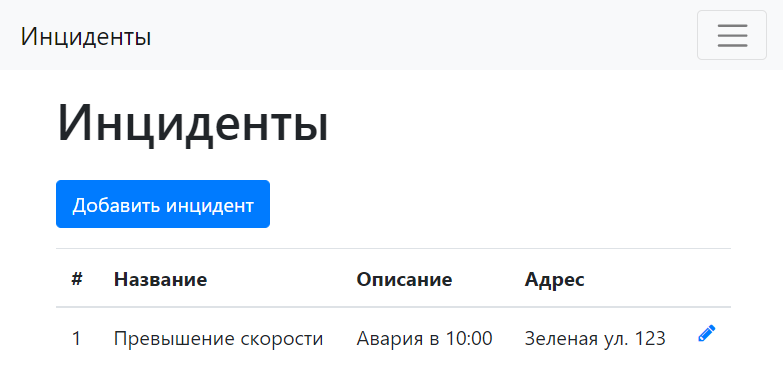

# job4j_car_accident

Учебный мини-проект в рамках курса [job4j](https://job4j.ru/)  
Технологии: Java 15, Spring, Hibernate, Spring Data, Spring Security, JSP, JSTL, Postgres, Bootstrap 4 
Реализованные возможности:
- Регистрация пользователя
- Создание/редактирование/удаление инцидента

